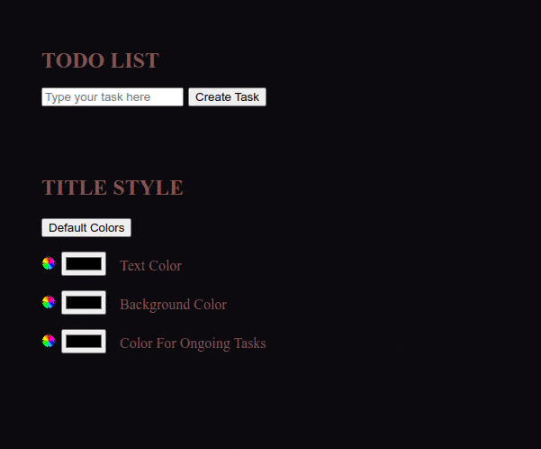
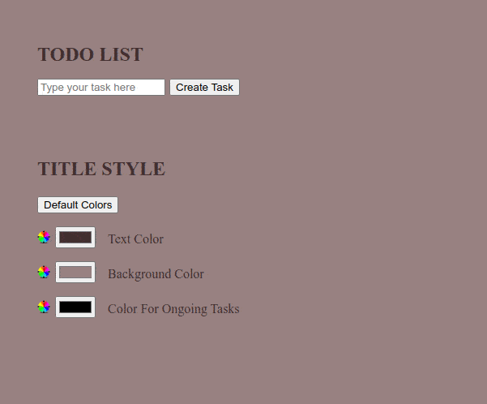

# Todo List

**Project type:** Front-end web project.  
**Brief description:** Todo list in pure JS, from the page structure to the style.  
**Technologies:** JavaScript.  

This is a vanilla JavaScript project from the bootcamp. We were asked to do everything in pure JS, from the page's structure to the style.  

---

The goal of this project was to learn DOM manipulation, and to this end I looked into what JavaScript allows to do. Everything has therefore been written in JS, so there is no CSS file and the HTML file is as bare as can be. It's also during this project that I've discovered the "contentEditable" HTML attribute, thanks to which text can be modified by simply being clicked on. This attribute comes in handy to modify tasks, and I've added it alongside of the more classic "Modify" button.  

<ins>Realtime style modification</ins>  

<ins>Todolist demonstration</ins>  

